[TOC]

## 一,实体类解析

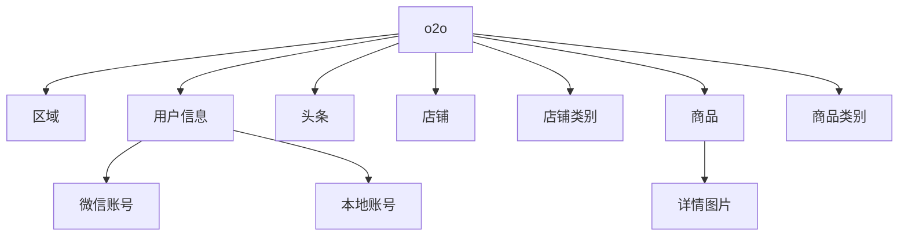
```mermaid
graph TB
A[o2o]-->B[区域]
A-->C[用户信息]
C-->C1[微信账号]
C-->C2[本地账号]
A-->D[头条]
A-->E1[店铺]
A-->E2[店铺类别]
A-->F[商品]
F-->F1[详情图片]
A-->G[商品类别]
```

## 二,表详情设计

### 1,区域

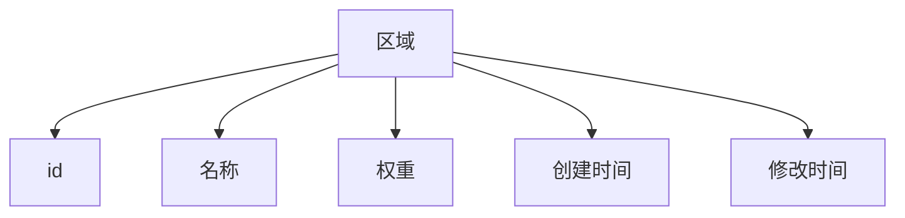
```mermaid
graph TB
A[区域]-->B[id]
A-->C[名称]
A-->D[权重]
A-->E[创建时间]
A-->F[修改时间]
```

### 2,用户

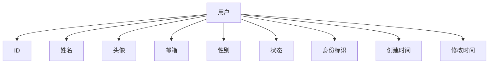
```mermaid
graph TB
A[用户]-->B[ID]
A-->C[姓名]
A-->D[头像]
A-->E[邮箱]
A-->F[性别]
A-->G[状态]
A-->H[身份标识]
A-->I[创建时间]
A-->J[修改时间]
```

### 3,微信账号

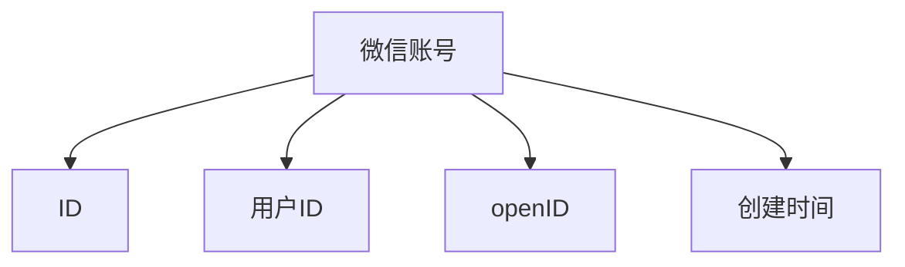
```mermaid
graph TB
A[微信账号]-->B[ID]
A-->C[用户ID]
A-->D[openID]
A-->E[创建时间]
```

### 4,本地账号 

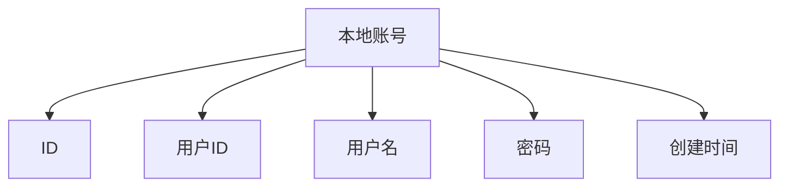
```mermaid
graph TB
A[本地账号]-->B[ID]
A-->C[用户ID]
A-->D[用户名]
A-->E[密码]
A-->F[创建时间]
```

### 5,头条

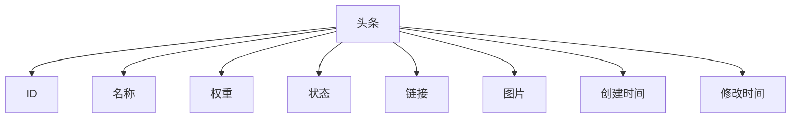
```mermaid
graph TB
A[头条]-->B[ID]
A-->C[名称]
A-->D[权重]
A-->E[状态]
A-->F[链接]
A-->G[图片]
A-->H[创建时间]
A-->I[修改时间]
```

### 6,店铺类别

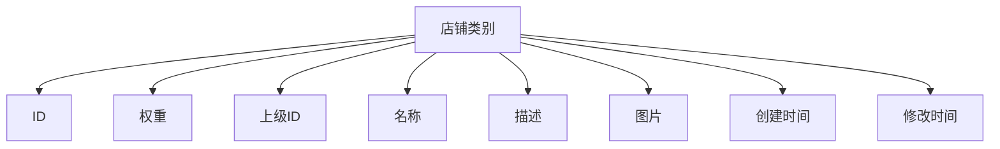
```mermaid
graph TB
A[店铺类别]-->B[ID]
A-->C[权重]
A-->D[上级ID]
A-->E[名称]
A-->F[描述]
A-->G[图片]
A-->H[创建时间]
A-->I[修改时间]
```

### 7,店铺

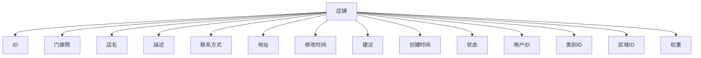
```mermaid
graph TB
A[店铺]-->B1[ID]
A-->B2[门面照]
A-->B3[店名]
A-->B4[描述]
A-->B5[联系方式]
A-->B6[地址]
A-->B7[修改时间]
A-->B8[建议]
A-->B9[创建时间]
A-->B10[状态]
A-->B11[用户ID]
A-->B12[类别ID]
A-->B13[区域ID]
A-->B14[权重]
```

### 8,产品类别

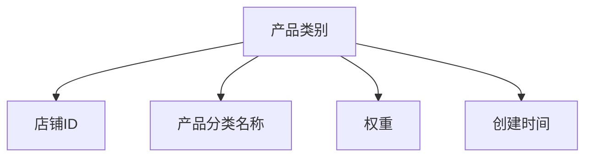
```mermaid
graph TB
A[产品类别]-->B1[店铺ID]
A-->B2[产品分类名称]
A-->B3[权重]
A-->B4[创建时间]
```

### 9,产品图片

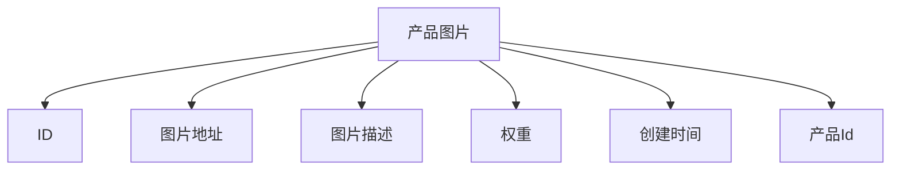
```mermaid
graph TB
A[产品图片]-->B1[ID]
A-->B2[图片地址]
A-->B3[图片描述]
A-->B4[权重]
A-->B5[创建时间]
A-->B6[产品Id]
```

### 10,商品

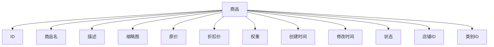
```mermaid
graph TB
A[商品]-->B1[ID]
A-->B2[商品名]
A-->B3[描述]
A-->B4[缩略图]
A-->B5[原价]
A-->B6[折扣价]
A-->B7[权重]
A-->B8[创建时间]
A-->B9[修改时间	]
A-->B10[状态]
A-->B11[店铺ID]
A-->B12[类别ID]
```

