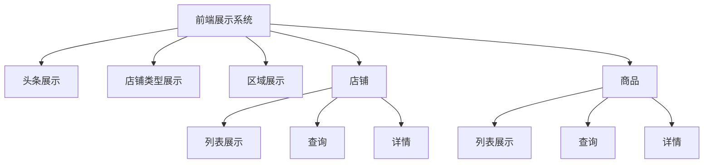
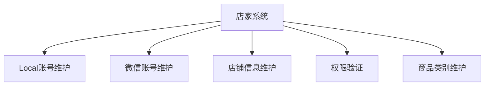
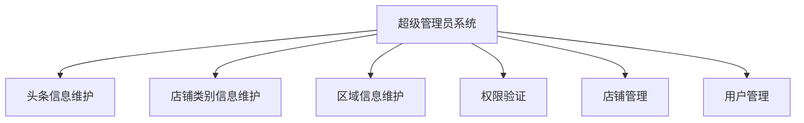

[TOC]

## 一,前端系统

```mermaid
graph TD
A[前端展示系统]-->B[头条展示]
A-->C[店铺类型展示]
A-->D[区域展示]
A-->E[店铺]
A-->F[商品]
E-->E1[列表展示] 
E-->E2[查询]
E-->E3[详情]
F-->F1[列表展示] 
F-->F2[查询]
F-->F3[详情]
```

## 二,店家系统

```mermaid
graph TB
A[店家系统]-->B[Local账号维护]
A-->C[微信账号维护]
A-->D[店铺信息维护]
A-->E[权限验证]
A-->F[商品类别维护]
```

## 三，超级管理员的维护

```mermaid
graph TB
A[超级管理员系统]-->B[头条信息维护]
A-->C[店铺类别信息维护]
A-->D[区域信息维护]
A-->E[权限验证]
A-->F[店铺管理]
A-->G[用户管理]
```

 

